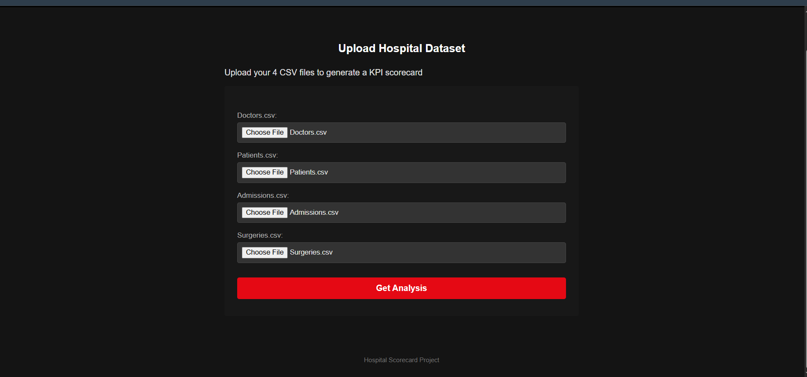
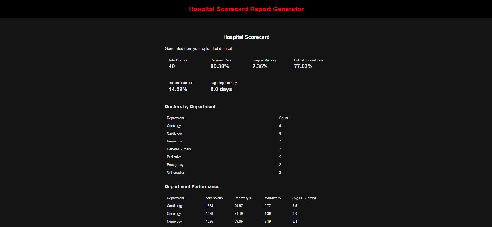
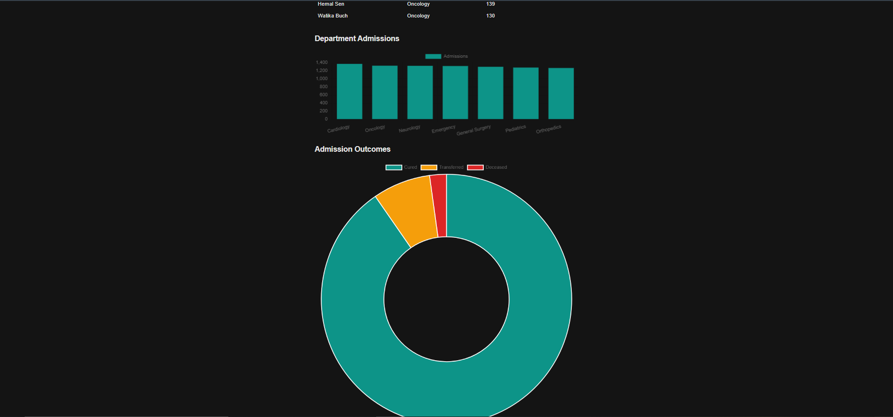

# 🏥 Hospital Analytics Dashboard

A Data Analytics project that transforms raw hospital datasets into actionable insights through data validation, SQL-based KPI analysis, and interactive dashboards.

The application allows users to upload hospital datasets, validates the uploaded data, stores it in a MySQL database, performs analytical SQL queries, and visualizes healthcare KPIs using an interactive dashboard.

---

## 📌 Project Highlights

- Multi-file CSV upload
- Automated data validation
- Bulk data ingestion into MySQL
- SQL-based KPI computation
- Interactive dashboard
- Healthcare performance analysis
- Dockerized deployment
- Cloud-hosted application (Render)

---

# 📊 Analytics Pipeline

```
Hospital CSV Files
        │
        ▼
Data Validation
        │
        ▼
Data Cleaning
        │
        ▼
Bulk Insert into MySQL
        │
        ▼
SQL KPI Analysis
        │
        ▼
Interactive Dashboard
```

---

# 📁 Dataset

The project analyzes four healthcare datasets:

- Doctors
- Patients
- Admissions
- Surgeries

Sample datasets are available inside the **sample_data/** folder.

---

# 📈 Key Performance Indicators (KPIs)

The dashboard computes and visualizes important healthcare metrics including:

- Total Doctors
- Total Patients
- Total Admissions
- Total Surgeries
- Average Doctor Experience
- Average Length of Stay
- Department-wise Admissions
- Department Performance
- Admission Outcomes
- Surgery Outcomes
- Recovery Rate
- Mortality Rate

These KPIs are generated using optimized SQL queries executed directly on the MySQL database.

---

# 📊 Dashboard Features

The dashboard provides:

- Executive KPI Cards
- Department Performance Table
- Admission Outcome Analysis
- Surgery Outcome Analysis
- Interactive Charts
- Hospital Performance Overview

---

# 🛠 Technology Stack

## Programming

- Python

## Backend

- Django

## Database

- MySQL (Aiven Cloud)

## Data Analysis

- SQL
- Pandas

## Visualization

- Chart.js
- HTML
- CSS
- JavaScript

## Deployment

- Docker
- Gunicorn
- WhiteNoise
- Render

---

# 📂 Project Structure

```
Hospital_Scorecard/
│
├── Config/
│
├── report/
│   ├── models.py
│   ├── views.py
│   ├── validators.py
│   ├── kpi_queries.py
│   ├── forms.py
│   ├── templates/
│   └── static/
│
├── sample_data/
│   ├── Doctors.csv
│   ├── Patients.csv
│   ├── Admissions.csv
│   └── Surgeries.csv
│
├── screenshots/
│   ├── upload_page.png
│   ├── report_page.png
│   └── chart_page.png
│
├── Dockerfile
├── entrypoint.sh
├── requirements.txt
└── README.md
```

---

# 💡 Data Validation

Before loading data into the database, the application validates:

- Required columns
- Missing values
- Duplicate records
- Data consistency
- Referential integrity
- Invalid data formats

Only validated datasets are stored in MySQL.

---

# ⚙️ Installation

Clone the repository

```bash
git clone https://github.com/<username>/Hospital_Scorecard.git
```

Move into the project directory

```bash
cd Hospital_Scorecard
```

Install dependencies

```bash
pip install -r requirements.txt
```

Create a `.env` file

```env
SECRET_KEY=your_secret_key

DEBUG=True

DB_NAME=database_name
DB_USER=username
DB_PASSWORD=password
DB_HOST=host
DB_PORT=3306
```

Run migrations

```bash
python manage.py migrate
```

Start the application

```bash
python manage.py runserver
```

---

# 🐳 Docker

Build the Docker image

```bash
docker build -t hospital-scorecard .
```

Run the container

```bash
docker run -p 8000:8000 hospital-scorecard
```

---

# ☁️ Deployment

The application is containerized using Docker and deployed on Render with:

- Gunicorn
- WhiteNoise
- Environment Variables
- Aiven Cloud MySQL

---

# 📸 Screenshots

## Dataset Upload



---

## Hospital Dashboard



---

## Analytics Charts



---

# 🎯 Skills Demonstrated

### Data Analysis

- Data Validation
- Data Cleaning
- SQL Analytics
- KPI Development
- Dashboard Design
- Data Visualization

### Database

- MySQL
- Relational Database Design
- Bulk Data Loading
- SQL Query Optimization

### Development

- Python
- Django
- Pandas
- Docker
- Cloud Deployment

---

# 🚀 Future Improvements

- Dashboard Filters
- Trend Analysis
- Export Dashboard as PDF
- Time-Series Analytics
- User Authentication

---

# 👨‍💻 Author

**Aditya Jha**

- GitHub: https://github.com/<your-username>
- LinkedIn: https://linkedin.com/in/<your-profile>
